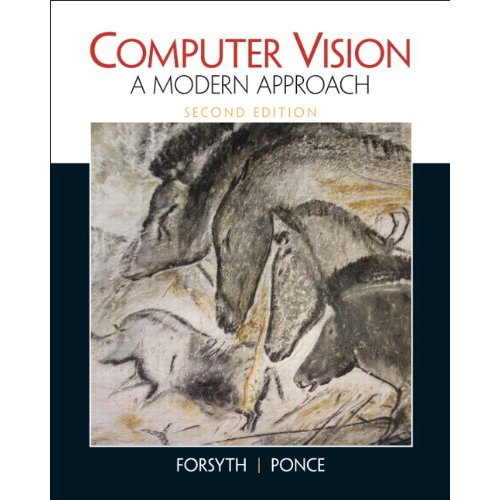
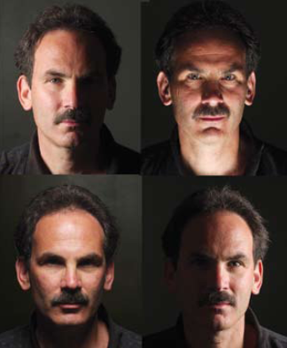

# 作者
罗世明 shl666@ucsd.edu

# 语言
Python3

# 写在最前面
这是一个改编自UCSD CSE252A的CV入门级教程，在此感谢[David J.Kriegman](http://cseweb.ucsd.edu/~kriegman/)教授对视觉小白（就是我）的启蒙。整个教程会涉及5块内容
1. **背景介绍与人类视觉**
1. **视觉几何** e.g. 透射几何、相机模型、透镜、刚体转换等
1. **3维重建** e.g. 双向反射分布函数（BRDF）、阴影（Shading）模型、光度立体技术（Photometric Stereo）等
1. **兴趣点／边界探测与立体视觉** e.g. 滤波器、核（Epipolar）几何、concer & edge detection、图像矫正等
1. **移动检测与深度学习浅谈** e.g. 视觉追踪、深度神经网络等

一共会有4次作业，都是jupyter notebook的形式，我尽量贴出详细解答，但是这要经过教授的允许，这里涉及到academic integrity的问题。

我会尽量标注所有专有名词的英文，以免对大家产生混淆。

参考书："Computer vision: A Modern Approach," (2nd ed.) David A. Forsyth, Jean Ponce, Prentice Hall, ISBN: 013608592X  

David大头照镇楼，希望我能写完这个教程...  

