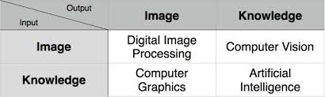
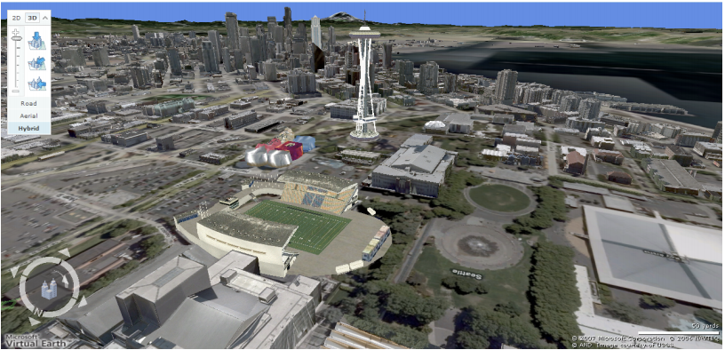
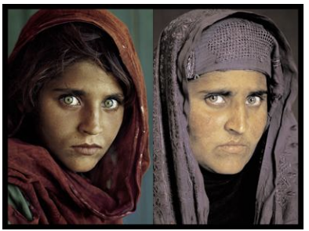
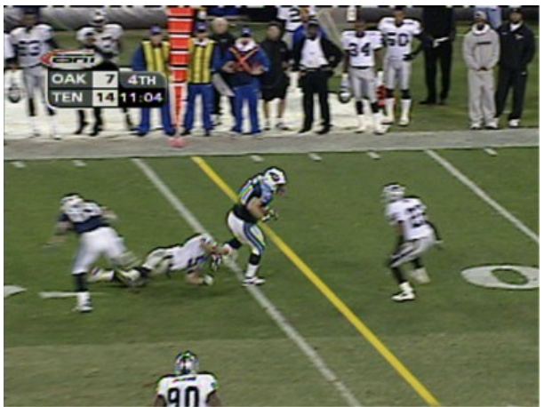
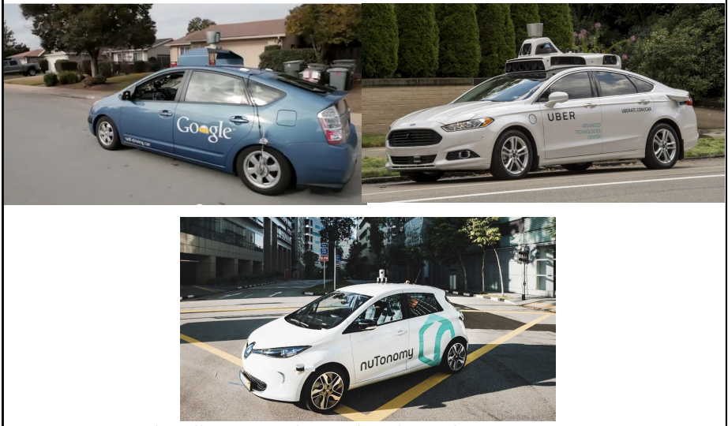
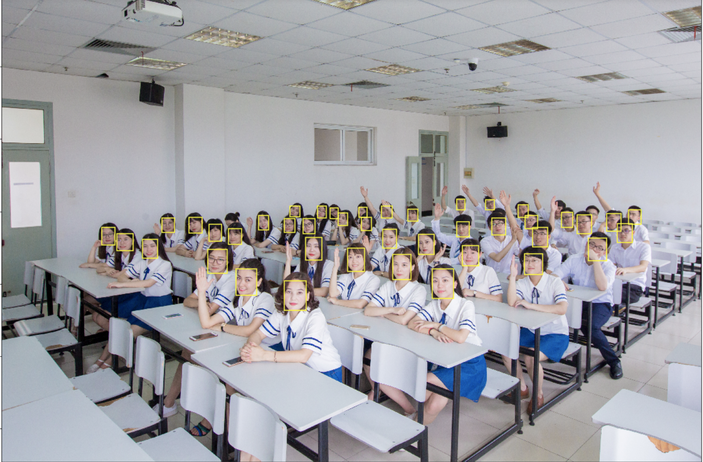

# 什么是**计算机视觉（CV: Computer Vision）**？
学习计算机视觉， 那么我们首先遇到的问题就是，计算机视觉到底是个什么东西？我们可以先从大佬们对计算机视觉的官方定义开始看起：

Trucco & Verri: 从一张或多张数字图像中计算3维世界的特性。

Sockman & Shapiro: 根据感知到的图像，对真实的物理对象和场景做出有用的决策。

Ballard & Brown: 从图像中对物理对象进行显式的、有意义的描述。

Forsyth & Ponce (Text): 从图片或图片序列中提取对世界的描述。

从这些大佬的描述中，我们（小白们）差不多可以描绘出一个计算机视觉的大致感觉。其实，现在说CV，逃不开另外一个话题——人工智能（AI: Artificial Inteligence）。有这么一种学派，它认为人工智能可以被分为**感知**和**决策**两个过程，CV则属于**感知**的过程。

在我看来，CV就是**从图像中提取信息的过程**。与之相对的，是计算机图形（Computer Graphics），一个从信息到绘制图像的过程。下面是我非常喜欢的一张图，很直观地描述了DIP／CV／CG／AI的关系。

既然提到了人工智能，作为话痨的我决定再多BB几句。人工智能的领域大概被分成了四块：
1. 推荐系统
这一块相对比较成熟，也是各大电商平台（马爸爸／某东等等）应用最多的一项技术，如：商品推荐／用户侧写之类的。另外在资讯／社交平台的应用也很广泛，带头的就是头条／微博。我们平时说的大数据，很大一部分指的就是这一块。
1. 自然语言处理（NLP：Natural Language Processing）
这也是近两年大热的话题。从微软的小冰（现在多了个小娜？），到前段时间打电话到餐厅订位骗过店员的Google Assistant，真的让人感觉很神奇。Bert模型的提出让NLP进入了一个新的高度（仿佛当年的CNN之于图像算法）。
1. 计算机视觉（CV：Compter Vision）
近年，深度学习算法横扫所有的计算机视觉类比赛，传统CV有逐渐被淘汰的趋势，更多的重心被放在Graphiics和正统的Machine Vision上（以机器人／自动驾驶技术为代表）。GAN网络的提出也是一大进步。
1. 强化学习 （Reinforcement Learning）
这里我把强化学习独立成类，因为它的理论和前面的技术几乎完全不同，而它又可以被应用于前面的任何一个方面。我们可能看到的更多的是它在各类游戏（多为棋类和MOBA类游戏）中的应用，击败李世石的Alpha Go，击败Alpha Go的Alpha Zero，Dota2中大显神威的AI bot，还有前两天发布的战平王者段位5人黑的腾讯AI技术。

# 计算机视觉的应用
所以，计算机视觉到底有啥用？

1. 3D模拟地图：谷歌地图／谷歌地球

1. 光学字符识别（OCR：Optical Character Recognition）

1. 面部识别 （Face Recgnition）

1. 虚拟图像转播技术（这里看上去更偏graphics）

1. 无人车／自动驾驶

1. 这里再很不要脸地贴一个自己的[小目标检测项目](https://github.com/shl666/SSD_small_object_detection) hhhhhhh

