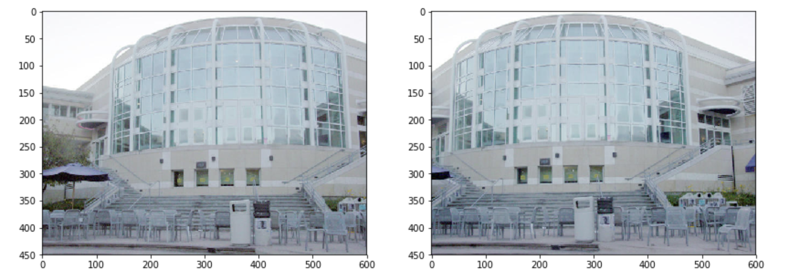
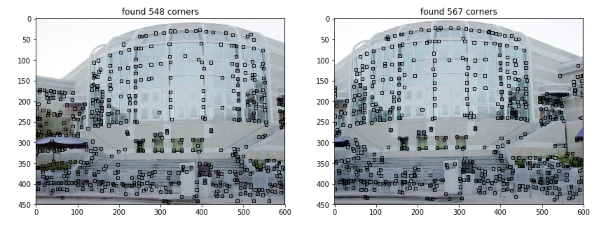
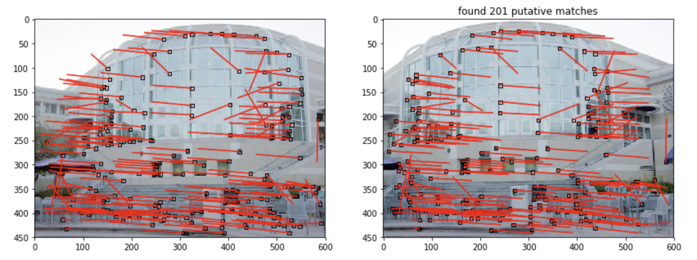

# 什么是特征点检测（Corner Detector）?
以下定义来自[维基百科](https://zh.wikipedia.org/wiki/%E8%A7%92%E6%A3%80%E6%B5%8B)：

特征点检测，是计算机视觉系统中用来提取特征以及推测图像内容的一种方法.角检测的应用很广，经常用在运动检测，跟踪，图像镶嵌（image mosaicing），全景图缝合（panorama stiching），三维建模以及物体识别中.

# 什么是特征点（Corner）？
以下定义来自[百度百科](https://baike.baidu.com/item/%E7%89%B9%E5%BE%81%E7%82%B9)：

图像处理中，特征点指的是图像灰度值发生剧烈变化的点或者在图像边缘上曲率较大的点(即两个边缘的交点)。图像特征点在基于特征点的图像匹配算法中有着十分重要的作用。图像特征点能够反映图像本质特征，能够标识图像中目标物体。通过特征点的匹配能够完成图像的匹配。

简单来说，特征点就是图像中具有代表性和鲁棒性的点，可以是角，也可以是局部亮点，抑或是线段终点。根据检测算法的不同，我们得到的特征点也有着区别。

# 示例
先看一下下面这两张图片（UCSD的PC）：

两张图片区别不大，（几乎）同一时间使用同一相机在不同角度拍下。 我们再来看看他们使用Forstner corner detection算法获得的特征点：

是不是几乎都是一致的？除了个别被覆盖的部分。接下来就是对这些特征点的匹配（matching）操作。

这样的matching结果，我们基本上可以看出两张图之间的变换关系了。之后利用这些关系，我们可以进行更多的应用操作。比如之前定义中提到的全景图缝合等。
